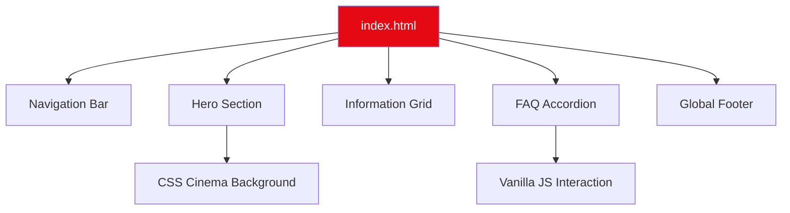

# 🎬 Netflix India Clone

  
  
  

 

A high-fidelity, responsive UI clone of the Netflix India landing page. This project focuses on pixel-perfect CSS layouts, modern design patterns, and smooth interactive elements.

---

## 📐 Layout Architecture

---

## 📺 Features
- **🎯 Pixel Perfect UI**: Replicates the authentic Netflix India homepage experience.
- **📱 Fluid Responsiveness**: Seamlessly adjusts to mobile, tablet, and desktop screens.
- **⚡ Custom FAQ**: JavaScript-powered accordion for an interactive user experience.
- **🎭 Motion Design**: Smooth hover transitions and cinematic background styling.

## 🛠️ Built With
- **Semantic HTML5**: For structured and accessible content.
- **Modern CSS3**: Utilizes Flexbox, Grid, and Variables.
- **Vanilla JavaScript**: Lightweight logic for UI state management.

---
*Developed by [Anurag Kodge](https://github.com/Kodge0001)*
